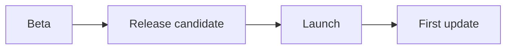

# Launch plan

## Timeline



## Checklist

### Website

- [x] Pricing page
- [x] Download page
- [ ] User manual

### Builds

- [x] macOS, notarized
- [ ] Windows installer
- [ ] Linux packages

## Release script

```sh
git tag v1.0.0
git push origin v1.0.0   # release.yml drafts the GitHub release
```

## Notes

The announcement should lead with the reading view and the AI region
editing, in that order. Everything else is a footnote for launch day.
