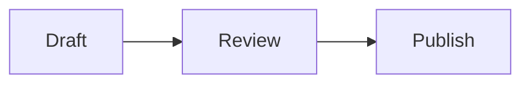

import Shot from '../../../components/Shot.astro';

The preview renders the document as you type. The same Rust markdown engine
renders the preview, the printed page, the exports, and the context the AI
reads, so what you see is what you get everywhere.

<Shot name="preview-only" alt="The preview alone, showing a rendered document with a tip callout, a list, and a table" caption="Preview view (⌘3)." />

## View modes

**View ▸ Editor Only** (<kbd>⌘1</kbd>), **Split** (<kbd>⌘2</kbd>), and
**Preview Only** (<kbd>⌘3</kbd>), or the control in the toolbar. In split
view the two panes scroll together in both directions.

The table-of-contents button in the toolbar lists every heading of the
document; pick one to jump there.

## What renders

Marginal renders GitHub-flavored markdown:

- Tables, strikethrough, autolinked URLs, and task lists.
- Footnotes.
- GitHub-style alerts: a quote starting with `> [!NOTE]`, `[!TIP]`,
  `[!IMPORTANT]`, `[!WARNING]`, or `[!CAUTION]` becomes a callout.
- YAML front matter between `---` lines, shown as a small block at the top.
- Heading anchors, so `[see above](#some-heading)` works.

Raw HTML in the document renders too, after sanitizing: scripts, event
handlers, and `javascript:` links are stripped.

### Code

Fenced code blocks are syntax-highlighted for the language named after the
opening fence. Hover a block and a **Copy** button appears.

### Diagrams

A fenced block whose language is `mermaid` renders as a diagram:

````md

````

Diagrams follow the current theme and are cached, so typing elsewhere in
the document does not redraw them. A diagram with a syntax error shows an
error box with its source instead of breaking the rest of the preview.

### Links

Web and mail links open in your browser. Links to headings scroll the
preview. A relative link to another `.md` file opens that file in a new
tab.

### Images

Images with a relative or absolute path on your disk are shown. Images
from the web are not loaded, by design: the preview never makes network
requests.

## Layout

**Settings ▸ Preview** sets the preview's font size, its column width, and
its margin. **Force light preview** keeps the preview light while the rest
of the app is dark, which is handy for judging how a printed page will
look.
